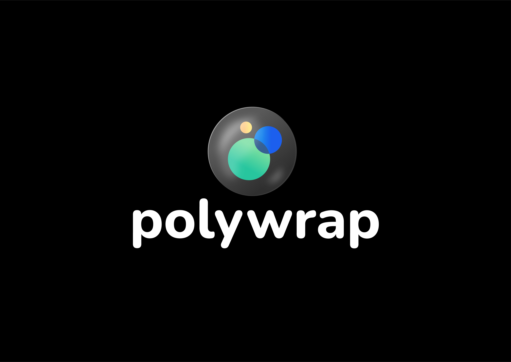

# Polywrap Branding

## Themed Banner

## Logo
  

> Check out the [brand official book](./Polywrap_Brandbook_public_2021.pdf) for in-depth detail of how to use the `polywrap` brand effectively.

## Positioning Strategy:
- Try to introduce the solution as a `Standard`, before diving deeper into the benefits and specific use cases.  
- It is also possible to position our brand as the `Web3 Standard`, or `Integration Standard`.  

## One-liner:
This summary covers the idea at a high level that's easy to understand:  
> The Polywrap Standard makes integrating any protocol quick and seamless without sacrificing decentralization.  

## Terminology

### Wrapper vs API, SDK, and Library
`A Polywrap wrapper is a multi-platform, Wasm based, SDK.`
Where we're still using words like “API”, “SDK” and “Library”, we should be replacing all of these with “Wrapper”.

### Multi-Platform vs Cross-Platform
We should be using **multi-platform** to describe Polywrappers, instead of cross-platform. This is based on the following definiiton:  
> Generally, you do cross-platform development when you use a tool that allows you to write code once and build it for many platforms. While multi-platform means your code runs on many platforms.  

Source: https://luismts.com/maui-cross-platform-vs-multi-platform/  

## Social Media handles

When possible, just use @polywrap. If the name is taken, use @polywrap_io.

## Designing  Wrapper

Follow these guides to create wrapper assets that follow the polywrap brand across all channels: 

### Anatomy of a Wrapper

### 3D wrappers with Gradients and shading

