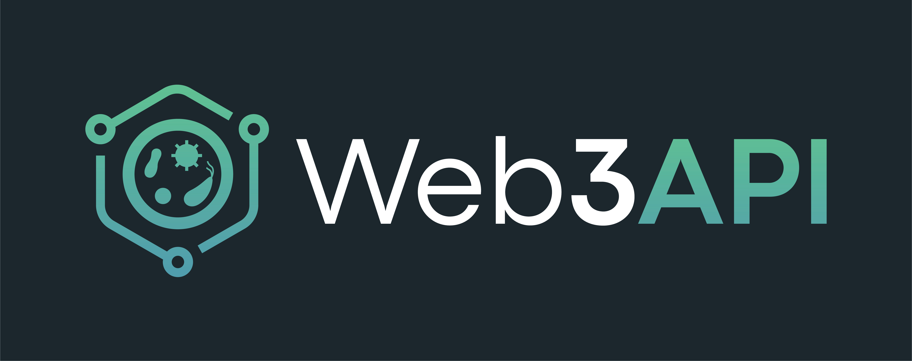

# Web3API Branding

## Positioning Strategy:
- Try to introduce the solution as a `Standard`, before diving deeper into the benefits and specific use cases.
- It is also possible to position our brand as the `Web3 Standard`, or `Integration Standard`.

## One-liner:
This summary covers the idea at a high level that's easy to understand:
> The Web3API Standard makes integrating Web3 protocols quick and seamless without sacrificing decentralization.

## Logo
  
